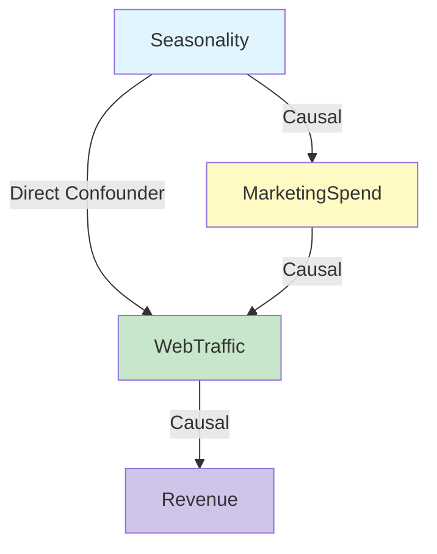

# GenPark Structural Causal Model DAG Interventional Engine Skill

Structural Causal Model (SCM) DAG engine evaluating observational distributions and simulating Pearl's do-calculus interventions.

Read more at [GenPark](https://genpark.ai) and the [GenPark MCP Catalog](https://genpark.ai/mcp).

## Features
- Pure Python standard library causal DAG representation.
- Pearl's do(X = x) graph surgery removing incoming directed edges.
- Exact structural state propagation across endogenous networks.
